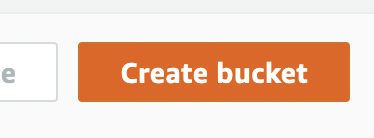
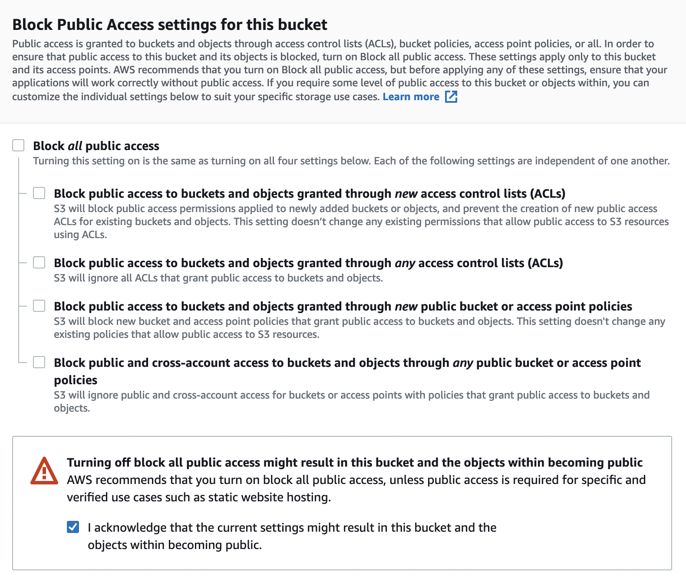
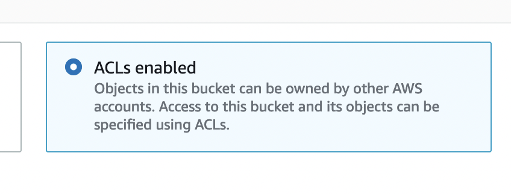
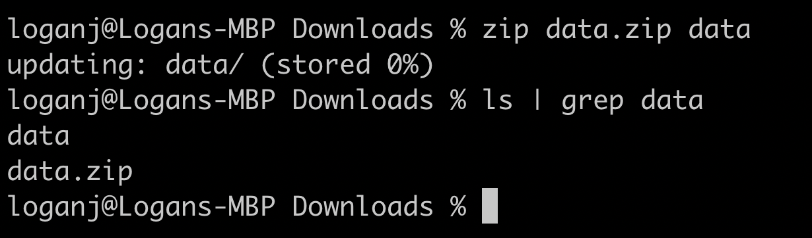
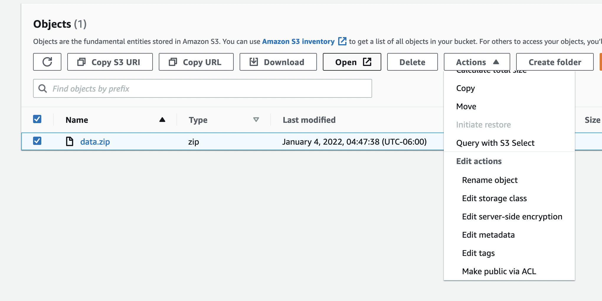
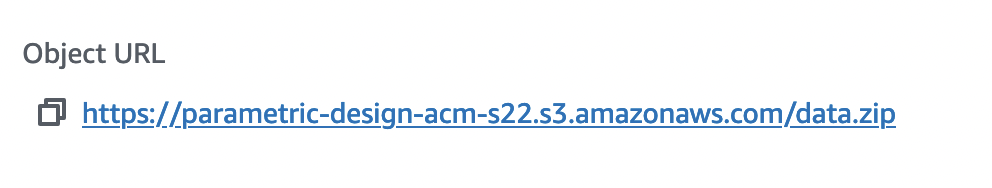

# Host Datasets on S3

A lot of projects in Research use large datasets, because of this we often run into many issues when using git. To get around those issues in the past we may have attempted to use git lfs, or git large file storage, this is not the move as we can only store ~1GB of information in LFS before we get bodied by microsoft. So instead of doing this, data should be store externally in a cloud storage bucket. For this I will be using AWS S3, I think you can also use GCP but that costs money so I'm not gonna do that, azure probably also has something but I have never used azure.

## Step 0.

Create an AWS, account sign up for AWS etc. etc. I assume that all humans can do this.

## Step 1.

Go to S3, you can find S3 by searching in the tool bar or by going to services -> storage -> s3

## Step 2.

Once you are here you can create a bucket by pressing the large orange button that says "create bucket"
 

## Step 3.

Name your bucket something, or just leave it blank for autogen name, the name has to be unique though, first uncheck the section "Block all public accesss" because we want to share the contents of our bucket publiclly with participants. Also check the aknowledgement. Second we want to enable ACLs

## Step 4.

Zipping your data, in this case I will upload some example data, to the storage bucket. This example data will be a .zip file you can zip files on UNIX operating systems by typing `zip data.zip [target_folder]`

## Step 5.

Upload this zipped folder to S3 by pressing the large orange "upload" button then pressing "add file" and selecting the file that you just zipped from the computer. 

## Step 6.

Enable public access via ACL, select the object that we want to have public access for and under the actions section select the option "Make public via ACL"

## Finally

You're done, this data has been uploaded and made public via AWS S3, and you can get the URL to access the data by clicking on the object name and finding "object url" under the overview this is the public url to download your data, and can be used by participants:

 
The link to the example used here is:
 
[https://parametric-design-acm-s22.s3.amazonaws.com/data.zip](https://parametric-design-acm-s22.s3.amazonaws.com/data.zip)
